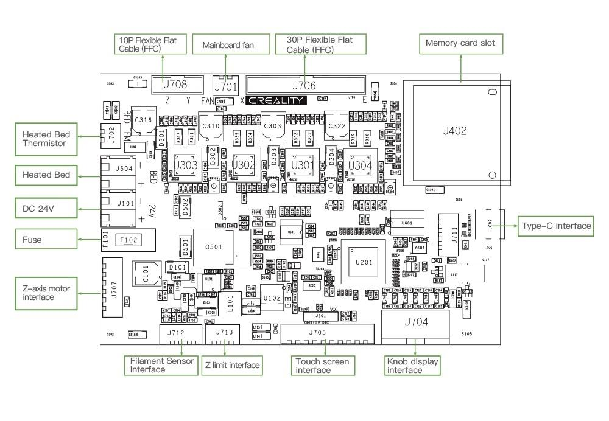

# Ender 3 S1 - Klipper, Marlin, and stock LCD Reference

## Ender3S1 Mainboard Diagram

## Marlin
  + [Github - Marlin Firmware Configurations](https://github.com/MarlinFirmware/Configurations)
    + [Marlin-Configurations__LCD_Files.README.md](./Marlin-Configurations/config/examples/Creality/Ender-3 S1/LCD Files/README.md)
      + [Ender 3 V2 - LCD firmware](./Marlin-Configurations/config/examples/Creality/Ender-3 V2/LCD Files)
    + [Marlin-Configurations.README.md](./Marlin-Configurations/config/examples/Creality/Ender-3 S1/README.md)
    + [Marlin-Configurations__STM32F1](./Marlin-Configurations/config/examples/Creality/Ender-3 S1/STM32F1)
    + [Marlin-Configurations__STM32F4](./Marlin-Configurations/config/examples/Creality/Ender-3 S1/STM32F4) (my board)
  + [GitHub - mriscoc/Ender3V2S1](https://github.com/mriscoc/Ender3V2S1/wiki/How-to-install-the-firmware)
  + [BTT_SKR_Mini_E3_V3__MarlinUI__configuration](./Marlin-Configurations/config/examples/Creality/Ender-3 V2/BigTreeTech SKR Mini E3 v3/MarlinUI)

## Klipper
  + [Ender 3 S1 Klipper Config - 3D Print Beginner](https://3dprintbeginner.com/wp-content/uploads/2022/02/Ender-3-S1-Klipper-Config-1.zip)
  + [Ender 3 S1 Klipper Config - local copy](./Ender 3 S1 Klipper Config/printer.cfg)

## How to tell the difference between Ender 3 LCDs
  For the Ender 3S1 you must to use the `private` display firmware / icon assets, available here:
  + **Original Ender 3V2 DWIN display**
    
  + **Original Ender 3S1 DACAI display**
    

