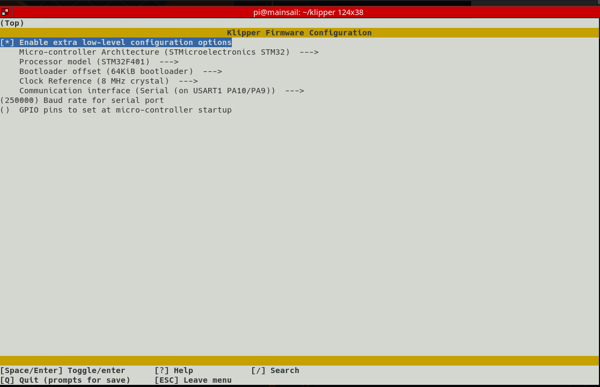

# Klipper on Creality 4.2.7 mainboard

## compile configuration
+ when compiling klipper, rename and place file [_.config](./_.config) at path `~/klipper/.config`
+ or, use `cd klipper ; make menuconfig`
  and replicate the following configuration
  


## printer.cfg options:
+ ["official" example printer.cfg configs from Klipper3d GitHub](https://github.com/Klipper3d/klipper/tree/master/config)
  + ["official" Ender3S1 example](./printer-creality-ender3-s1-2021.cfg)
+ [3dprintbeginner - Ender 3 S1 Klipper Config](https://3dprintbeginner.com/wp-content/uploads/2022/02/Ender-3-S1-Klipper-Config-1.zip)
+ [./jmedlin_Ender3-S1-Pro--Klipper-Config__printer.cfg](https://github.com/jmedlin/Ender3-S1-Pro--Klipper-Config/blob/main/README.md)
+ [./nickgarvey__s1-printer.cfg](https://gist.github.com/nickgarvey/b52aa81e0ef14dca58a501880d07df46)
+ [./VariousCaregiver1413_-_pastebin__printer.cfg](https://pastebin.com/m3vdX6Lk)


## BLtouch / CRtouch config and notes [#bltouch]

  + [BL-Touch - Docs](https://www.klipper3d.org/BLTouch.html#initial-tests)
  + [BL-Touch - Config](https://www.klipper3d.org/Config_Reference.html?h=bltouch#bltouch)
  + [BL-Touch - gcodes](https://www.klipper3d.org/G-Codes.html#bltouch)

  #### CR-Touch Wiring Diagram/Pinout
    * [Reference - Reddit post on crtouch wiring](https://www.reddit.com/r/Creality/comments/pl4fyv/creality_cr_touch_wiring_diagrampinout/)
  
  #### Wiring, Pinout, Klipper config
    * pin order is left-to-right, viewed from the rear (backwards from view with "crtouch" logo on front)

    * ![CRtouch wiring][crtouch_pinout]
    |:------------:|:------------------------------:|:----------------------:|
    |  Pin #       |  Description                   |   Klipper parameter    |
    |:------------:|:------------------------------:|:----------------------:|
    |  1 (RED)     |   GND                          |                        |
    |  2 (GREEN)   |   +5V                          |                        |
    |  3 (L. BLUE) |   PWM Signal                   |  bltouch[control_pin]  |
    |  4 (D. BLUE) |   GND (for probe/endstop)      |                        |
    |  5 (PURPLE)  |   SIGNAL (for probe/endstop)   |  bltouch[sensor_pin]   |
    |:------------:|:------------------------------:|:----------------------:|


## PINDA / proximity detection probes


## Beacon3d ABL 
  + using eddy currents for bed detection

  + example moonraker source update config
    ```cfg
    [update_manager beacon]
    type: git_repo
    channel: dev
    path: ~/beacon_klipper
    origin: https://github.com/beacon3d/beacon_klipper.git
    env: ~/klippy-env/bin/python
    requirements: requirements.txt
    install_script: install.sh
    is_system_service: False
    managed_services: klipper
    info_tags:
      desc=Beacon Surface Scanner
    ```

## Bed Mesh (KAMP)
  + [KAMP](https://github.com/kyleisah/Klipper-Adaptive-Meshing-Purging)

  + see also: [Faster Bed Mesh macro](https://3dprintbeginner.com/faster-klipper-bed-probing-macro/)


## moar macros

  + [Desuuuu/klipper-macros](https://github.com/Desuuuu/klipper-macros/tree/master/macros)


## Extruder config

  ### Orbiter 2.0 motor wiring

    * I had to swap the pins of *one of the coils* for my LDO motor so that it will rotate in the correct direction.
    * [see stepper motor wiring for reversing direction](https://electronics.stackexchange.com/questions/70643/how-to-reverse-rotation-direction-of-stepper-motor#70701)


[crtouch_pinout]: https://preview.redd.it/t8x2xttg6xv81.png
