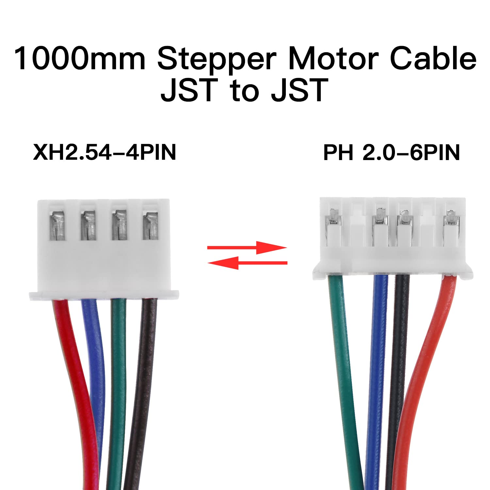

# Ender-3-S1-Klipper-BTT-Manta-E3EZ-V1-0

*From:*
  Ender 3 S1 (stock)
*To:*
  BIGTREETECH Manta E3EZ V1.0 (with pi-cm4) w/ MainsailOS

----
## IMPORTANT - Latest Mainboard Variants of STM32F401

+ There are two variants - STM32F401RET6 and STM32F401RCT6 (mine), that sucks.
  STM32F401RCT6 SoC has only 256k flash memory, while STM32F401RET6 has 512k
  This limits either what firmware you can install or what features can be
  enabled when compiling firmware so the bin actually fits.

From [mriscoc wiki](https://github.com/mriscoc/Ender3V2S1/wiki#versions) regarding that firmware:
> ...some features are disabled in the F4 UBL firmware version, for
> example: BAUD_RATE_GCODE, INDIVIDUAL_AXIS_HOMING_SUBMENU, SOUND_MENU_ITEM,
> LONG_FILENAME_WRITE_SUPPORT, BINARY_FILE_TRANSFER, POWER_LOSS_RECOVERY.

----
## Links

+ Ender 3
  + [General setup / reference](https://howchoo.com/diy/setting-up-creality-ender-3-v2-3d-printer)
  + [Ender 3 V2 Firmware - Reddit](https://www.reddit.com/r/Ender3v2Firmware/)

+ Ender 3 S1
  + [Ender 3 S1 - service tutorial : mainboard replacement](https://youtu.be/hOpYfUAOO-4)
  + [mriscoc/Ender3V2S1 - Marlin Firmware](https://github.com/mriscoc/Ender3V2S1)

+ [BTT SKR Mini E3 V3.0](https://biqu.equipment/collections/control-board/products/bigtreetech-skr-mini-e3-v2-0-32-bit-control-board-for-ender-3)
  So, _SKR Mini E3_ does not support more than 4 motor drivers, therefore independent control of
  dual-Z-axis motors is not possible (nor >1 extruder).  Therefore, we will instead be replacing
  Creality mainboard with _BTT Manta E3_
  + [SKR-mini-E3-V3.0-klipper.cfg](https://github.com/bigtreetech/BIGTREETECH-SKR-mini-E3/blob/master/firmware/V3.0/Klipper/SKR-mini-E3-V3.0-klipper.cfg)
  + [great guide by theSt33v to setup SKR Mini E3 on Ender3S1](https://github.com/theSt33v/Ender-3-S1-Skr-Mini-E3V3-Edition)
  + Awesome Guide with great explanation for motor wiring
    [SKR Mini E3 V3.0 Setup Guide - makenprint.uk](https://www.makenprint.uk/3d-printing/3d-printing-guides/3d-printer-mainboard-installation-guides/btt-skr-mini-e3-v3-guides/btt-skr-mini-e3-v3-setup-guide/)

+ [BTT Manta E3EZ V1.0](https://github.com/bigtreetech/Manta-E3EZ/)
  + with rPi-CM4 or BTT-CB1

+ [OctoPrint](https://octoprint.org/)
  + [OctoKlipper Plugin](https://plugins.octoprint.org/plugins/klipper/)

+ Klipper and stuff
  + [KIAUH](https://github.com/th33xitus/kiauh) - install Klipper,Moonraker,etc. (installer script)
  + [How To Install Klipper On Creality Ender 3 S1: Config And Setup | 3D Print Beginner](https://3dprintbeginner.com/how-to-install-klipper-on-ender-3-s1/)
  + [How To Install FluiddPi On RaspberryPi | 3D Print Beginner](https://3dprintbeginner.com/how-to-install-fluiddpi-on-raspberry-pi/)

+ Wiring Stepper Motors
  When replacing Creality 4.2.7 Mainboard some re-wiring needs to be done since stepper motor wires
  interface with stock mainboard using 10P or 30P FFC cables, whereas SKR E3 Mini board uses JST-XH
  connectors for individual stepper motors.
  I'm trying out (o.g./vanilla) [Ender3 replacement motor
  cables](https://www.amazon.com/dp/B07SYJQFKR?psc=1&ref=ppx_yo2ov_dt_b_product_details) at least for now, until I can verify functionality and then make my own.
  + [Stepper Motor Wiring Conventions](https://caggius.wordpress.com/stepper-motor-wiring-conventions/)
  + 

  + [Reddit - Don't fry your mainboard with inappropriately wired X2.54 stepper motor connectors!](https://www.reddit.com/r/ender3/comments/dgunne/dont_fry_your_mainboard_with_inappropriately/)

  + understanding stepper motor wiring and suggestions on testing your motor to figure it out
    [Stepper Motor Wiring - makenprint.uk](https://www.makenprint.uk/3d-printing/3d-printing-guides/3d-printer-troubleshooting/stepper-motor-wiring/)

  + possible wiring diagrams:
  + https://www.youtube.com/watch?v=LLmWM-2FkvI

### Ender 3 S1 - mainboard diagram
  

  ##### Sprite Extruder wire harness pinout - ProperPrinting.pro
  

## BIGTREETECH SKR Mini E3 V3.0 (cutsheet)
  

## BIGTREETECH MANTA E3EZ V1.0
  [BTT Manta E3EZ V1.0 - Schematic](https://github.com/bigtreetech/Manta-E3EZ/blob/master/Hardware/BIGTREETECH%20Manta%20E3EZ%20V1.0-SCH.pdf)
  
  

