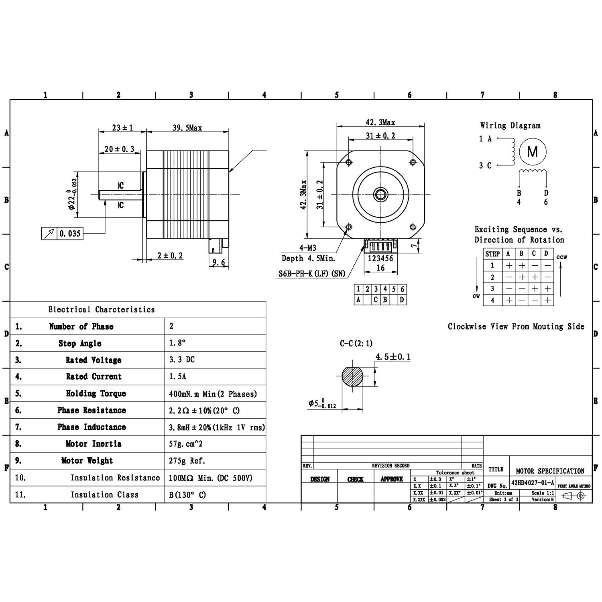
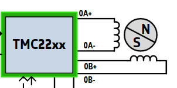
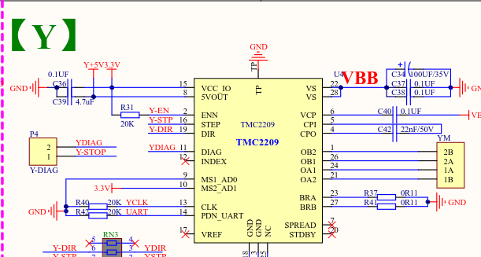
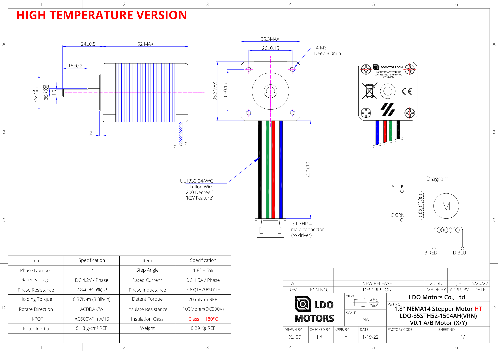

# Stepper Motor Wiring

Including Conventions with Examples

*******************************************************************************


## Creality Stepper motor "42-34"  (our example in this document)

### Motor Diagram:

[Creality_42-34_Stepper_Motor_Specs.jpg](./resources/Creality_42-34_Stepper_Motor_Specs.jpg)


### Motor Specifications:

    > Step angle: 1.8 degrees
    > Steps: 200
    > Rated Voltage: 3.3V DC
    > Rated Current: 1.5A
    > Rated speed: 1-1000rpm
    > Rated torque: 0.4NM
    > Ambient Temperature: -20 - 50℃
    > Length: 34mm
    > Weight: 275g
    > Coils: 2
    > Phase Resistance: 2.2 ohm +- 10% (20 degrees Celsius)
    > Phase Inductance: 3.8mH +- 20% (1khz 1V rms)
    > Motor Inertia: 57g. cm^2

### Motor Coil Internal Wiring (Creality 42-34):

 + NOTE: Second coil leads identified as `B` and `D` are sometimes marked as A\` and B\`

Fig 1.a
      
    PIN (COIL)
                           ****    
      1 (A) ───────)     **    **  
                   )    *        * 
                   )   *  MOTOR   *
                   )    *        * 
      3 (C) ───────)     **    **  
                           ****    
                                    
                        ╭╮╭╮╭╮╭╮╭╮
                        │        │  
                        │        │  
                                    
                       (B)      (D)
                                    
                        4        6  


### Motor Input Connector Diagram (JST-PH 2.0mm):

+ NOTE: below 'JST-PH' connector (Fig 1.b) is common on stepper motors and
        correspond to labels in above coil wiring diagram (Fig 1.a)

Fig 1.b

    ┌────────────────────┐
    │                    │
    │  1  2  3  4  5  6  │
    └───┬─┬────────┬─┬───┘

      (A)   (C)(B)   (D)


### Coil Exciting Sequence:

Fig 2.a

               _____________________________    
    Direction  | STEP  | A  | B  | C  | D  |  Direction
        ↓      |:-----:|:--:|:--:|:--:|:--:|      ↑
        ↓      |  1    | +  | +  | -  | -  |      ↑
        ↓      |  2    | -  | +  | +  | -  |      ↑
        ↓      |  3    | -  | -  | +  | +  |      ↑
        ↓      |  4    | +  | -  | -  | +  |      ↑
       CW      |_______|____|____|____|____|     CCW


### Motor Output Connector (ex: Octopus, SKR):

Fig 1.c

    JST-XH  2.54mm connector

           2B  2A  1A  1B
        ┌─────────────────┐
        │                 │
        │  O   O   O   O  │
        │                 │
        └──┬─┬───────┬─┬──┘

    PIN   (1) (2) (3) (4)


### Motor Input connector (6-pin) - cable side, facing female pins

+ JST-PH  2.0mm connector - [specifications](../resources/JST-PH-connector-datasheet.pdf)

+ NOTE: this is the connector on the wire side (not the connector found on the motor itself)

Fig 2.b

              COIL  #2        COIL  #1
            _____________  ______________
 
            BLK       BLU  GRN       RED
             │    NC   │    │    NC   │
             │    │    │    │    │    │
             │    │    │    │    │    │
        ┌──┬─┴────┴────┴────┴────┴────┴─┬──┬┐
        │  │                            │  ││
        │  │                            │  ││
        │  │                            │  ││
        │  └────────────────────────────┘  ││
        │                                  ││
        ├───┬─┬──┬─┬──┬─┬──┬─┬──┬─┬──┬─┬───┼│
        │   └─┘  └─┘  └─┘  └─┘  └─┘  └─┘   ││
        │                                  ││
        ├──────────────────────────────────┼│
        └───────────────────────────────────┘

    PIN     (6)  (5)  (4)  (3)  (2)  (1) 


### Motor Control Wiring Diagram (with color-coded wires)

* 1/2 indicates which motor coil
* A/B indicates Neg(-) or Pos(+)
* Wire Color is arbitrary but follows conventions described in linked additional reference[^1]

Fig. 2.c

    --------------------------------------------------------------------------------------------
    | Controller |  Wire   |  Motor |  Coil     |   Wire   |  Motor   |  Motor  |  Multimeter  |
    |  Pinout    |  Color  |  Coil  |  Polarity |   Color  |  Input   |  Coil   |  Continuity  |
    |:----------:|:-------:|:------:|:---------:|:--------:|:--------:|:-------:|:------------:|
    |            |         |        |           |          |          |         |______________|
    |    2B  >---┼---RED---┼-- #2 --┼--- (+) ---┼---RED----┼--- (1) --┼--A---8) |              |
    |            |         |        |           |          |          |      (  | 1-3  (BEEP!) |
    |    2A  >---┼---BLU---┼-- #2 --┼--- (-) ---╳---GRN----┼--- (3) --┼--?---8) |______________|
    |    1A  >---┼---GRN---┼-- #1 --┼--- (-) ---╳---BLU----┼--- (4) --┼--?---8) |              |
    |            |         |        |           |          |          |      (  | 4-6  (BEEP!) |
    |    1B  >---┼---BLK---┼-- #1 --┼--- (+) ---┼---BLK----┼--- (6) --┼--D---8) |______________|
    |            |         |        |           |          |          |         |              |
    |____________|_________|________|___________|__________|__________|_________|______________|

    Legend: X   cross wiring
            8)  motor coil


### TMC2209 Schematic and Motor Wiring Reference

* TMC2209 Pinout Labels and Functions [^TMC2209-Datasheet]

  ```
    | PIN | Num |   Function    | SKR MINI E3 v3 (PIN) | MOTOR | INPUT | Multimeter  |
    |:---:|:---:|:-------------:|:--------------------:|:-----:|:-----:|:-----------:|
    | OB2 | 1   | Coil B #2 (-) |  2B ──────────────── | A     | PIN 1 |  ---B       |
    |     |     |               |                      |   NC  |       |     E       |
    | OA2 | 21  | Coil A #2 (-) |  1B ──┐  ┌────────── | C     | PIN 3 |     E  ---B |
    | OA1 | 24  | Coil A #1 (+) |  1A ─┐└──│────────── | B     | PIN 4 |  ---P     E |
    |     |     |               |      └─────┐         |   NC  |       |           E |
    | OB1 | 26  | Coil B #1 (+) |  2A ─────┘ └──────── | D     | PIN 6 |        ---P |
  ```

  NOTE: above "motor" referrs to 'LDO-42STH40-1684MAC'

* example motor coil wiring diagram with TMC2209 pin labels
    

* Below illustrates how the JST-XH pinouts on the SKR board are tied to the TMC driver chip.
  We can trace (bypassing BTT confusing pinout labels) the physical wire connection from driver chip
  to the motor coils by comparing the motor wiring datasheet[^LDO] to TMC2209 Datasheet[^TMC2209-Datasheet].
  

Together, they

'TMC2209 pinout schematic' and 

  

* References:
    * TMC2209 Datasheet rev1.08 [^TMC2209-Datasheet] 
    * BTT SKR Mini E3 v3 Schematic [^BTT-E3-SKR-MINI-V3-SCH] 
    * [BTT SKR Mini E3 v3 Driver Example Pinout Schematic](./resources/BTT-SKR-Mini-E3-v3-TMC2209-schematic.png)

----

## LDO motors are slightly different:
...but much better documented

* [LDO Motor Specs - Google Sheet](https://docs.google.com/spreadsheets/d/1pF3C6IbiJz44WxOxgQQkXBXwV3a6IzvVz9nmk3owrdM/view)
+ [LDO-42STH25-1404MAC](./resources/LDO-42STH25-1404MAC_TIM_RevA.pdf)
+ [LDO-42STH60-2004MAC](./resources/LDO-42STH60-2004MAC_RC_RevB.pdf)
+ [LDO-42STH25-1604AC - Micron+ Z-axis](./resources/LDO-42STH25-1404MAC_TIM_RevA.pdf)
* [LDO-35STH52-1504AH(VRN) - Micron+ A/B](./resources/LDO-35STH52-1504AHVRN_RevA-technical-datasheet.pdf)


#### Examples:

#### Notice the connector to coil wiring differences (ACBD vs. ABCD) for motors `42STH38-1684MAC` vs. `42STH47-1684MAC`
+ [LDO-42STH38-1684MAC](./resources/LDO-42STH38-1684MAC_TIM_RevA.pdf)
+ [LDO-42STH47-1684MAC](./resources/LDO-42STH47-1684MAC_RevA_9f61050a-7275-4b98-a6c5-9f28bd0cb2b7.pdf)


----

## Klipper Notes:

* remember to use `STEPPER_BUZZ` to verify the direction of motors.  See [Verify stepper motors](https://www.klipper3d.org/Config_checks.html?h=stepper#verify-stepper-motors)


## Explanation

    When testing continuity on motor input pins, you will find continuity between each of the pos/neg pins for each of the coils.
    This way you can verify your wiring from the controller's pinout is mostly correct, at least for each of the coils.
    Consult your motor's specifications for exactly what polarity is expected.


### If your motor is moving the wrong direction

    It actually does matter which coil is which and what the polarity of the coils are. However, if they're wrong, the motor just turns the wrong way, 
    Switching the polarity of either (one) coil, like swapping motor input pins 1/4 (RED/BLUE)  or 3/6 (GREEN/BLACK)
    Motor direction can also be reversed in the firmware, so keep this in mind before possibly destroying your cable or connector.


## TMC Driver Specs

  * BigTreeTech EZ Driver Specs: [EZ2208][^EZ2208], EZ2209[^EZ2209], EZ2130[^EZ2130], EZ5160[^EZ5160]

    |  Product     |  EZ 5160 Pro  |  EZ 5160 RGB  |  EZ 2130     |  EZ 2209     |  EZ 2208     |  EZ 2226     | EZ 6609      |
    |:------------:|:-------------:|:-------------:|:------------:|:------------:|:------------:|:------------:|-------------:|
    | Driver       |  TMC5160-TA   |  TMC5160-TA   |  TMC2130-LA  |  TMC2209-LA  |  TMC2208-LA  |  TMC2226-SA  |  GC6609      |
    | Voltage      |  8-48V        |  8-48V        |  12-24V      |  12-24V      |  12-24V      |  12-24V      |  12-24V      |
    | Max Current  |  2.5A         |  4.7A         |  2A(QFN)     |  2A          |  2A          |  2A          |  2A          |
    | RMS Current  |  1.6A         |  3A           |  0.9A        |  1.3A        |  1.2A        |  1.3A        |  1.2A        |
    | Mode         |  SPI          |  SPI          |  SPI         |  UART        |  UART        |  UART        |  UART        |
    | Resistance   |  0.075 Ω      |  0.05 Ω       |  0.11 Ω      |  0.11 Ω      |  0.11 Ω      |  0.11 Ω      |  0.11 Ω      |
    | StealthChop  |      ✔        |      ✔        |      ✔       |      ✔       |      ✔       |       ✔      |              |
    | SpreadCycle  |      ✔        |      ✔        |      ✔       |      ✔       |      ✔       |       ✔      |              |
    | StallGuard   |      ✔        |      ✔        |      ✔       |      ✔       |              |       ✔      |              |


## Additional References

[^1]: [Explanation of stepper motor wiring](https://caggius.wordpress.com/stepper-motor-wiring-conventions/)
[^2]: [Make 'n' Print - Stepper Motor Wiring](https://www.makenprint.uk/3d-printing/3d-printing-guides/3d-printer-mainboard-installation-guides/btt-skr-mini-e3-v3-guides/btt-skr-mini-e3-v3-setup-guide/#steppermotorwiring)
[^3]: [Reddit - Don't fry your mainboard with inappropriately wired X2.54 stepper motor connectors!](https://www.reddit.com/r/ender3/comments/dgunne/dont_fry_your_mainboard_with_inappropriately/)
[^TMC2209-Datasheet]: [Analog Devices Technical Documentation - TMC2209 Datasheet rev1.08](https://www.analog.com/media/en/technical-documentation/data-sheets/TMC2209_datasheet_rev1.08.pdf)
[^6]: [TMC2209_driver_schematic.png](./resources/TMC2209_wiring_schematic.png)
[^BTT-E3-SKR-MINI-V3-SCH]: [BTT_E3_SKR_MINI_V3.0_SCH.pdf](.resources/BTT_E3_SKR_MINI_V3.0_SCH.pdf)
[^EZ2209]: [BTT Driver EZ2209](https://bttwiki.com/EZ2209.html)
[^EZ2208]: [BTT Driver EZ2209](https://bttwiki.com/EZ2208.html)
[^EZ2130]: [BTT Driver EZ2130](https://bttwiki.com/EZ2130.html)
[^EZ5160]: [BTT Driver EZ5160 Pro](https://bttwiki.com/EZ5160%20Pro.html)

